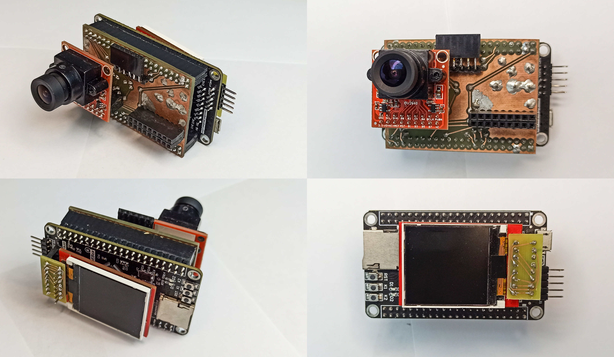
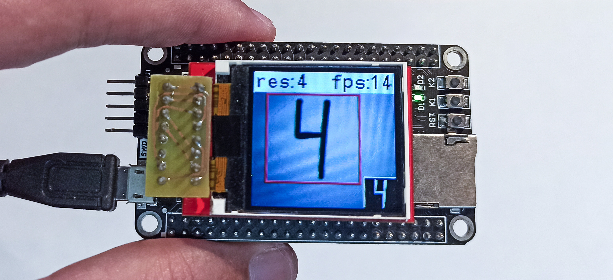
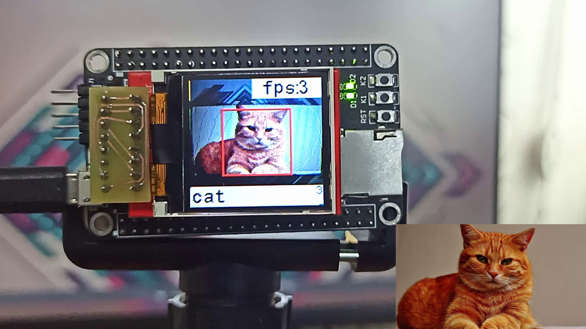
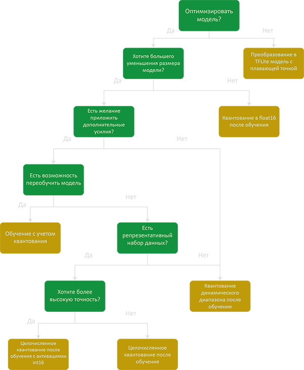
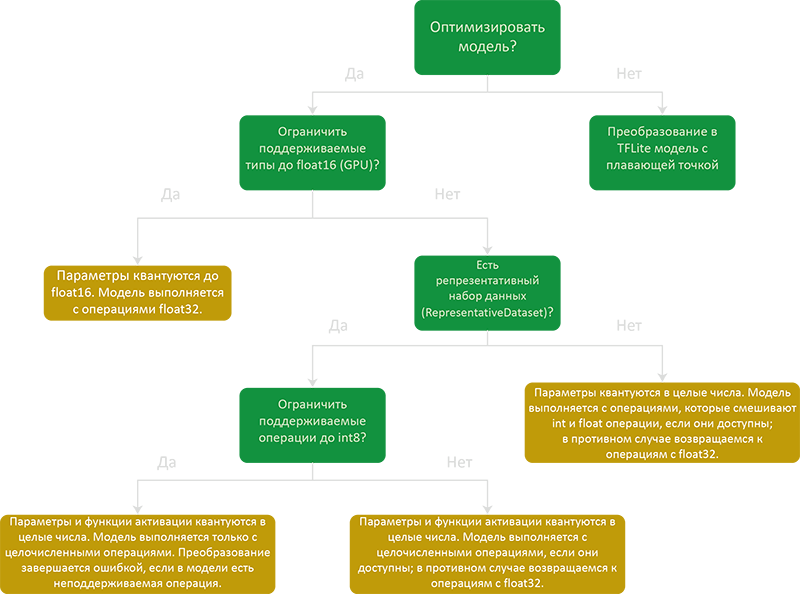

# AI on STM32

Neural network implementation on STM32 with Cube-AI.

Проект для демонстрации работы нейронных сетей на микроконтроллерах STM32.

- [Hardware](https://github.com/darkyfoxy/AI_on_STM32#hardware)
- [STMicroelectronics.X-CUBE-AI](https://github.com/darkyfoxy/AI_on_STM32#stmicroelectronicsx-cube-ai)
- [Example with MNIST Dataset](https://github.com/darkyfoxy/AI_on_STM32#example-with-mnist-dataset)
- [Example with CIFAR10 Dataset](https://github.com/darkyfoxy/AI_on_STM32#example-with-cifar10-dataset)
- [Example with CIFAR100 SuperClasses Dataset](https://github.com/darkyfoxy/AI_on_STM32#example-with-cifar100-superclasses-dataset)
	- [Optimization methods](https://github.com/darkyfoxy/AI_on_STM32#optimization-methods)
	  - [TensorFlow Lite without optimization](https://github.com/darkyfoxy/AI_on_STM32#tensorflow-lite-without-optimization)
	  - [TensorFlow Lite with Cube-AI compression (x4/x8)](https://github.com/darkyfoxy/AI_on_STM32#tensorflow-lite-with-cube-ai-compression-x4x8)
	  - [Quantization](https://github.com/darkyfoxy/AI_on_STM32#quantization)
	- [Optimization methods comparison](https://github.com/darkyfoxy/AI_on_STM32#optimization-methods-comparison)
- [Example with MobileNet](https://github.com/darkyfoxy/AI_on_STM32#example-with-mobilenet)
- [Copyright](https://github.com/darkyfoxy/AI_on_STM32#copyright)

## Hardware

Для экспериментов был собран стенд:



Изображение снимается на камеру [OV2640](https://mcustore.ru/store/datchiki-i-sensory/kamera-ov2640-1600x1200/) (*Разрешение матрицы датчика изображения: 1600x1200*).

Камера через плату-коннектор подключена к отладочной плате от [DevEBox]( https://github.com/mcauser/MCUDEV_DEVEBOX_H7XX_M ) c микроконтроллером STM32H743VIT6 (*480 MHz,  2M Flash, 1M RAM*).

Изображение и результат выводиться на [TFT LCD дисплей](https://arduino-kit.ru/product/displey-144_-color-tft-128h128-spi) 1.44 дюйма с контроллером ili9163 (*Разрешение матрицы 128x128*).

## STMicroelectronics.X-CUBE-AI

Для всех экспериментов использовался пакет программного обеспечения **STMicroelectronics.X-CUBE-AI.6.0.0**

## Example with MNIST Dataset

Демонстрация работы нейронной сети для распознавания рукописных цифр на микроконтроллере STM32H743.

Код для обучения нейронной сети, нейронная сеть и выборки для валидации доступны в [репозитории](https://github.com/darkyfoxy/AI_on_STM32/tree/main/network_MNIST).

С помощью генератора кода STM32CubeMX и расширения X-CUBE-AI нейронная сеть была реализована на микроконтроллер STM32H743.



**PyTorch and ONNX**

Нейронная сеть была обучена с помощью PyTorch на датасетe MNIST. После этого экспортирована в граф вычислений в формате **ONNX**.

**Keras**

Нейронная сеть была обучена с помощью TensorFlow на датасетe MNIST. После этого сохранена в формате **Keras** H5.

**TensorFlow Lite**

Нейронная сеть была обучена с помощью TensorFlow на датасетe MNIST.

После этого сохранена в формате **TF Lite** без квантования и с квантованием весов до *int8* (**TF Lite (Quant)**).

Конфигурация квантования:

```python
converter.optimizations = [tf.lite.Optimize.DEFAULT]
converter.target_spec.supported_ops = [tf.lite.OpsSet.TFLITE_BUILTINS_INT8]
converter.inference_input_type = tf.int8
converter.inference_output_type = tf.int8
converter.representative_dataset = representative_dataset
```

---

**Flash comparison***

| Сompression |   ONNX    |   Keras   |  TF Lite  | TF Lite (Quant) |
| :---------- | :-------: | :-------: | :-------: | :-------------: |
| None        | 778.16 KB | 778.16 KB | 778.16 KB |    195.74 KB    |
| x4          | 203.60 KB | 203.60 KB | 203.60 KB |  Not supported  |
| x8          | 105.63 KB | 105.63 KB | 105.63 KB |  Not supported  |

**RAM comparison***

| Сompression |  ONNX   |  Keras  | TF Lite | TF Lite (Quant) |
| ----------- | :-----: | :-----: | :-----: | :-------------: |
| None        | 4.66 KB | 4.66 KB | 4.66 KB |     1.17 KB     |
| x4          | 4.66 KB | 4.66 KB | 4.66 KB |  Not supported  |
| x8          | 4.66 KB | 4.66 KB | 4.66 KB |  Not supported  |

**Time on target comparison***

| Сompression |   ONNX   |  Keras   | TF Lite  | TF Lite (Quant) |
| ----------- | :------: | :------: | :------: | :-------------: |
| None        | 2.702 ms | 2.702 ms | 2.702 ms |    0.873 ms     |
| x4          | 2.657 ms | 2.653 ms | 2.654 ms |  Not supported  |
| x8          | 2.513 ms | 2.513 ms | 2.513 ms |  Not supported  |

**Accuracy comparison***

| Сompression |      ONNX       |      Keras      |     TF Lite     | TF Lite (Quant) |
| ----------- | :-------------: | :-------------: | :-------------: | :-------------: |
| None        | 91.6% (91.6%)** | 93.8% (93.8%)** | 93.8% (93.8%)** | 95.4% (95.4%)** |
| x4          | 91.5% (91.5%)** | 93.9% (93.9%)** | 93.9% (93.9%)** |  Not supported  |
| x8          | 91.7% (91.7%)** | 93.8% (93.8%)** | 93.8% (93.8%)** |  Not supported  |

*Во всех вариантах использовались одинаковые граф вычислений и дадасет для валидации. **Веса моделей различны**;

**Validation on target (Validation on desktop).

Из [документации от STMicroelectronics](https://www.st.com/resource/en/user_manual/dm00570145-getting-started-with-xcubeai-expansion-package-for-artificial-intelligence-ai-stmicroelectronics.pdf) (п. 6.1) компрессия размера весов и смещений основана на методе [k-средних](https://ru.wikipedia.org/wiki/Метод_k-средних) и применима только к полносвязным слоям.

[Видео демонстрации работы](https://www.youtube.com/watch?v=OYYefBLlM6g) .

## Example with CIFAR10 Dataset

Демонстрация работы нейронной сети для распознавания образов на микроконтроллере STM32H743.
Классификация производиться на 10 классов: 0 - airplane; 1 - automobile; 2 - bird; 3 - cat; 4 - deer; 5 - dog; 6 - frog; 7 - horse; 8 - ship; 9 - truck.

Код для обучения нейронной сети, нейронная сеть и выборки для валидации доступны в [репозитории](https://github.com/darkyfoxy/AI_on_STM32/tree/main/network_CIFAR10).

С помощью генератора кода STM32CubeMX и расширения X-CUBE-AI нейронная сеть была реализована на микроконтроллер STM32H743.



**PyTorch and ONNX**

Нейронная сеть была обучена с помощью PyTorch на датасетe CIFAR10. После этого экспортирована в граф вычислений в формате **ONNX**.

PyTorch экспортирует модель в ONNX таким образом, что идет оптимизация полностязного слоя в матричное умножение (GeMM). После этого  X-CUBE-AI не может произвести компрессию размера весов и смещений. Как это исправить я не знаю. Если кто знает, сообщите мне)

**Keras**

Нейронная сеть была обучена с помощью TensorFlow на датасетe CIFAR10. После этого сохранена в формате **Keras** H5.

**TensorFlow Lite**

Нейронная сеть была обучена с помощью TensorFlow на датасетe CIFAR10. После этого сохранена в формате **TF Lite** без квантования и с квантованием весов до *int8* (**TF Lite (Quant)**).

Конфигурация квантования:

```python
converter.optimizations = [tf.lite.Optimize.DEFAULT]
converter.target_spec.supported_ops = [tf.lite.OpsSet.TFLITE_BUILTINS_INT8]
converter.inference_input_type = tf.int8
converter.inference_output_type = tf.int8
converter.representative_dataset = representative_dataset
```


---

**Flash comparison***

| Сompression |    ONNX    |   Keras   |  TF Lite  | TF Lite (Quant) |
| :---------- | :--------: | :-------: | :-------: | :-------------: |
| None        |  1.04 MB   |  1.04 MB  |  1.04 MB  |    267.76 KB    |
| x4          | WARNING*** | 682.66 KB | 682.66 KB |  Not supported  |
| x8          | WARNING*** | 617.73 KB | 617.73 KB |  Not supported  |

**RAM comparison***

| Сompression |    ONNX    |   Keras   |  TF Lite  | TF Lite (Quant) |
| ----------- | :--------: | :-------: | :-------: | :-------------: |
| None        | 148.41 KB  | 148.41 KB | 148.41 KB |    43.63 KB     |
| x4          | WARNING*** | 148.41 KB | 148.41 KB |  Not supported  |
| x8          | WARNING*** | 148.41 KB | 148.41 KB |  Not supported  |

**Time on target comparison***

| Сompression |    ONNX    |   Keras    |  TF Lite   | TF Lite (Quant) |
| ----------- | :--------: | :--------: | :--------: | :-------------: |
| None        | 285.562 ms | 285.169 ms | 285.171 ms |   106.633 ms    |
| x4          | WARNING*** | 285.120 ms | 285.133 ms |  Not supported  |
| x8          | WARNING*** | 285.040 ms | 285.048 ms |  Not supported  |

**Accuracy comparison***

| Сompression |      ONNX       |      Keras      |     TF Lite     | TF Lite (Quant) |
| ----------- | :-------------: | :-------------: | :-------------: | :-------------: |
| None        | 83.0% (83.0%)** | 82.5% (82.5%)** | 82.5% (82.5%)** | 81.5% (81.5%)** |
| x4          |   WARNING***    | 82.5% (82.5%)** | 82.5% (82.5%)** |  Not supported  |
| x8          |   WARNING***    | 82.5% (82.5%)** | 82.5% (82.5%)** |  Not supported  |

*Во всех вариантах использовались одинаковые граф вычислений и дадасет для валидации. **Веса моделей различны**;

**Validation on target (Validation on desktop);

***X-CUBE-AI выдает предупреждение (WARNING: no weight was compressed) из-за GeMM оптимизации.

[Видео демонстрации работы](https://www.youtube.com/watch?v=fylVEovoXl0) .

## Example with CIFAR100 SuperClasses Dataset

Демонстрация работы нейронной сети для распознавания образов на микроконтроллере STM32H743.
Классификация производиться на 20 супер-классов: 0 - aquatic mammals; 1 - fish; 2 - flowers; 3 - food containers; 4 - fruit and vegetables; 5 - household electrical devices; 6 - household furniture; 7 - insects; 8 - large carnivores; 9 - large man-made outdoor things; 10 - large natural outdoor scenes; 11 - large omnivores and herbivores; 12 - medium-sized mammals; 13 - non-insect invertebrates; 14 - people; 15 - reptiles; 16 - small mammals; 17 - trees; 18 - vehicles 1; 19 - vehicles 2.

Код для обучения нейронной сети, нейронная сеть и выборки для валидации доступны в [репозитории](https://github.com/darkyfoxy/AI_on_STM32/tree/main/network_CIFAR100).

С помощью генератора кода STM32CubeMX и расширения X-CUBE-AI нейронная сеть была реализована на микроконтроллер STM32H743.

Нейронная сеть была обучена с помощью TensorFlow на датасетe CIFAR100.

### Optimization methods

#### TensorFlow Lite without optimization

Нейронная сеть сохранена в формате TFLite без каких-либо оптимизаций.

```python
converter = tf.lite.TFLiteConverter.from_saved_model(network_dir_path)
model_no_quant_tflite = converter.convert()

open("network_without_optim.tflite", "wb").write(model_no_quant_tflite)
```

#### TensorFlow Lite with Cube-AI compression (x4/x8)

Нейронная сеть сохранена в формате TFLite без каких-либо оптимизаций. После этого в среде CubeMX применена компрессия весов посносвязных слоёв на основе метода k-средних.

#### Quantization

Квантованные модели - это модели, в которых мы используем параметры с более низкой точностью, такие как 8-битные целые числа вместо от 32-битных чисел с плавающей точкой.



*Изображение переведено с сайта [TensorFlow](https://www.tensorflow.org/lite/performance/model_optimization).

**TensorFlow Lite with рost-training quantization**

Квантование после обучения - это метод преобразования, который может уменьшить размер модели, а также уменьшить время выполнения. При этом точности модели незначительно уменьшается.



*Изображение переведено с сайта [TensorFlow](https://www.tensorflow.org/lite/performance/post_training_quantization).

***Dynamic range quantization (DRQ)***

```python
converter = tf.lite.TFLiteConverter.from_saved_model(network_dir_path)

converter.optimizations = [tf.lite.Optimize.DEFAULT]
model_tflite = converter.convert()

open("network_DRQ.tflite", "wb").write(model_tflite)
```

Cube-AI:

```
WARNING: Hybrid layer dense_55 not supported. - Mapping on float version
...
TOOL ERROR: Didn't find op for builtin opcode 'CONV_2D' version '5'
```

***Full integer quantization (FIQ)***

```python
converter = tf.lite.TFLiteConverter.from_saved_model(network_dir_path)

def representative_dataset():
  for i in range(500):
    yield([test_images[i].reshape(1, 32, 32, 3).astype(np.float32)])

converter.optimizations = [tf.lite.Optimize.DEFAULT]
converter.representative_dataset = representative_dataset
model_tflite = converter.convert()

open("network_FIQ.tflite", "wb").write(model_tflite)
```

***Integer only: 16-bit activations with 8-bit weights (INT16_INT8)***

```python
converter = tf.lite.TFLiteConverter.from_saved_model(network_dir_path)

def representative_dataset():
  for i in range(500):
    yield([test_images[i].reshape(1, 32, 32, 3).astype(np.float32)])

converter.optimizations = [tf.lite.Optimize.DEFAULT]
converter.representative_dataset = representative_dataset
converter.target_spec.supported_ops = [tf.lite.OpsSet.EXPERIMENTAL_TFLITE_BUILTINS_ACTIVATIONS_INT16_WEIGHTS_INT8]
model_tflite = converter.convert()

open("network_INT16_INT8.tflite", "wb").write(model_tflite)
```

Cube-AI:

```
NOT IMPLEMENTED: Unexpected numpy.dtype: int64 (dict_keys(['uint8', 'int8', 'uint16', 'int16', 'uint32', 'int32', 'float32', 'bool']))
```

***Integer only: 16-bit activations with 8-bit weights with BUILTINS (INT16_INT8_BUILTINS)***

```python
converter = tf.lite.TFLiteConverter.from_saved_model(network_dir_path)

def representative_dataset():
  for i in range(500):
    yield([test_images[i].reshape(1, 32, 32, 3).astype(np.float32)])

converter.optimizations = [tf.lite.Optimize.DEFAULT]
converter.representative_dataset = representative_dataset
converter.target_spec.supported_ops = [tf.lite.OpsSet.EXPERIMENTAL_TFLITE_BUILTINS_ACTIVATIONS_INT16_WEIGHTS_INT8,
                                       tf.lite.OpsSet.TFLITE_BUILTINS]
model_tflite = converter.convert()

open("network_INT16_INT8_BUILTINS.tflite", "wb").write(model_tflite)
```

Cube-AI:

```
NOT IMPLEMENTED: Unexpected numpy.dtype: int64 (dict_keys(['uint8', 'int8', 'uint16', 'int16', 'uint32', 'int32', 'float32', 'bool']))
```

***Integer only: BUILTINS (BUILTINS)***

```python
converter = tf.lite.TFLiteConverter.from_saved_model(network_dir_path)

def representative_dataset():
  for i in range(500):
    yield([test_images[i].reshape(1, 32, 32, 3).astype(np.float32)])

converter.optimizations = [tf.lite.Optimize.DEFAULT]
converter.representative_dataset = representative_dataset
converter.target_spec.supported_ops = [tf.lite.OpsSet.TFLITE_BUILTINS]
model_tflite = converter.convert()

open("network_BUILTINS.tflite", "wb").write(model_tflite)
```

***Full integer quantization Integer only (FIQ_int_only)***

```python
converter = tf.lite.TFLiteConverter.from_saved_model(network_dir_path)

def representative_dataset():
  for i in range(500):
    yield([test_images[i].reshape(1, 32, 32, 3).astype(np.float32)])

converter.optimizations = [tf.lite.Optimize.DEFAULT]
converter.representative_dataset = representative_dataset
converter.target_spec.supported_ops = [tf.lite.OpsSet.TFLITE_BUILTINS_INT8]
model_tflite = converter.convert()

open("network_FIQ_int_only.tflite", "wb").write(model_tflite)
```

***Full integer quantization Integer only with inference input/output type (FIQ_int_only_IIOT)***

```python
converter = tf.lite.TFLiteConverter.from_saved_model(network_dir_path)

def representative_dataset():
  for i in range(500):
    yield([test_images[i].reshape(1, 32, 32, 3).astype(np.float32)])

converter.optimizations = [tf.lite.Optimize.DEFAULT]
converter.representative_dataset = representative_dataset
converter.target_spec.supported_ops = [tf.lite.OpsSet.TFLITE_BUILTINS_INT8]
converter.inference_input_type = tf.int8
converter.inference_output_type = tf.int8
model_tflite = converter.convert()

open("network_FIQ_int_only_IIOT.tflite", "wb").write(model_tflite)
```

***Float16 quantization (float16)***

```python
converter = tf.lite.TFLiteConverter.from_saved_model(network_dir_path)

converter.optimizations = [tf.lite.Optimize.DEFAULT]
converter.target_spec.supported_types = [tf.float16]
model_tflite = converter.convert()

open("network_float16.tflite", "wb").write(model_tflite)
```

Cube-AI:

```
INTERNAL ERROR: 'FLOAT16'
```


---

### Optimization methods comparison

| Optimization         |   Flash   |    RAM    | Time on target |     Accuracy      |
| :------------------- | :-------: | :-------: | :------------: | :---------------: |
| without optimization |  1.78 MB  | 196.08 KB |   341.742 ms   | 71.67% (71.67%)** |
| Cube-AI x4           |  1.75 MB  | 196.08 KB |   343.088 ms   | 71.67% (71.67%)** |
| Cube-AI x8           |  1.74 MB  | 196.08 KB |   343.069 ms   | 72.67% (72.67%)** |
| DRQ*                 |     -     |     -     |       -        |         -         |
| FIQ                  | 458.52 KB | 59.25 KB  |   134.764 ms   | 64.00% (64.00%)** |
| INT16_INT8*          |     -     |     -     |       -        |         -         |
| INT16_INT8_BUILTINS* |     -     |     -     |       -        |         -         |
| BUILTINS*            | 458.52 KB | 59.25 KB  |   134.767 ms   | 64.00% (64.00%)** |
| FIQ_int_only         | 458.52 KB | 59.25 KB  |   134.775 ms   | 64.00% (64.00%)** |
| FIQ_int_only_IIOT    | 458.52 KB | 49.92 KB  |   134.938 ms   | 64.00% (64.00%)** |
| float16*             |     -     |     -     |       -        |         -         |
|                      |           |           |                |                   |

*Cube-AI ERROR;

**Validation on target (Validation on desktop);

## Example with MobileNet

Демонстрация работы нейронной сети для распознавания образов на микроконтроллере STM32H743.
Классификация производиться на [1001 класс](./network_MobileNet/imagnet_lables.txt).

Нейронные сети доступны на сайте [TensorFlow](https://www.tensorflow.org/lite/guide/hosted_models) или на [TensorFlow Hub](https://tfhub.dev) или на [GitHub](https://github.com/tensorflow/models/blob/master/research/slim/nets/mobilenet_v1.md).

С помощью генератора кода STM32CubeMX и расширения X-CUBE-AI нейронная сеть была реализована на микроконтроллер STM32H743.


---

#### Model comparison

| Name                        |   Flash   |     RAM     | Time on target | Top-1* | Top-5* |
| --------------------------- | :-------: | :---------: | :------------: | :----: | :----: |
| mobilenet_v1_0.25_128_quant | 467.58 KB |  114.54 KB  |   57.410 ms    | 39.5%  | 64.4%  |
| mobilenet_v1_0.25_160_quant | 467.58 KB |  177.92 KB  |   89.128 ms    | 42.8%  | 68.1%  |
| mobilenet_v1_0.25_192_quant | 467.58 KB |  255.29 KB  |   127.995 ms   | 45.7%  | 70.8%  |
| mobilenet_v1_0.25_224_quant | 467.58 KB |  346.67 KB  |   175.739 ms   | 48.2%  | 72.8%  |
| mobilenet_v1_0.50_128_quant |  1.28 MB  |  180.10 KB  |   153.405 ms   | 54.9%  | 78.1%  |
| mobilenet_v1_0.50_160_quant |  1.28 MB  |  279.85 KB  |   242.991 ms   | 57.2%  | 80.5%  |
| mobilenet_v1_0.50_192_quant |  1.28 MB  |  401.60 KB  |   334.688 ms   | 59.9%  | 82.1%  |
| mobilenet_v1_0.50_224_quant |  1.28 MB  | 545.35 KB** |       --       | 61.2%  | 83.2%  |

*From [TensorFlow site](https://www.tensorflow.org/lite/guide/hosted_models).

**region RAM_D1 overflowed


## Copyright

Some parts of this code were taken from other repositories. 

For OV2640 driver from [OpenMV repository](https://github.com/openmv/openmv).

For TFT ili9163 display driver from [Spirit532 repository](https://github.com/Spirit532/ILI9163C_STM32_HAL_DMA).

Other drivers without special instructions from STMicroelectronics.
